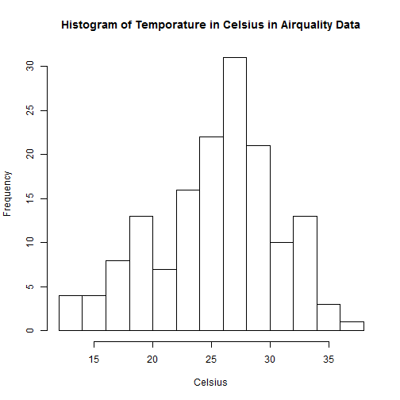
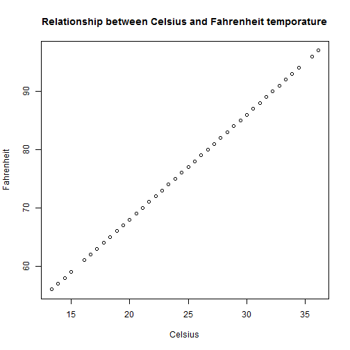

Project 1 Rstudio Presentation
========================================================
author: Castino
date: Sep 15, 2014


Presentation Outline
========================================================

Motivation of developing my application
- Build a convenient tool for temporature conversion


Process of application development
- Develop with R Shiny Package
- Validate the conversion results with airquality data
- Deploy the application to RPUBS
- Share with everyone!!


Mathmatical Expression for Temporature Conversion
========================================================

### Celsius to Fahrenheit: Celsius temp multiply by 9/5, then add 32

*  Fahrenheit = Celsius * (9/5)) + 32


### Fahrenheit to Celsius:  Fahrenheit temp minus 32, then divided by 1.8

* Celsius =  (Fahrenheit- 32) * (5/9)


Simulation with R Sample Data
========================================================


```r
airquality$Fahrenheit = airquality$Temp
summary(airquality$Fahrenheit)
```

```
   Min. 1st Qu.  Median    Mean 3rd Qu.    Max. 
   56.0    72.0    79.0    77.9    85.0    97.0 
```

Make the F -> C Convertion 


```r
airquality$Celsius = (airquality$Fahrenheit - 32) * (5/9)
summary(airquality$Celsius)
```

```
   Min. 1st Qu.  Median    Mean 3rd Qu.    Max. 
   13.3    22.2    26.1    25.5    29.4    36.1 
```


Plotting the Results generated from App
========================================================

Distribution of temporature in Celsius in airquality data

 

***

Relationship between Celsius and Fahrenheit temporatures

 


